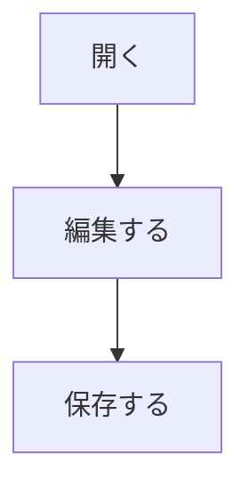

# 未対応の記法を壊さないこと

要件7.4の「未対応の記法が存在しても、保存時に内容を失わない」を確かめます。
**整形して表示できるかではなく、開いて保存したときに元のままかを見てください。**

なお、上のフロントマターの`---`は、いまの実装では水平線として扱われます。
表示の話であって、原文は変わりません。

## 表

| 記法 | 初期版での扱い | 備考 |
|------|----------------|------|
| 表 | 記法を保持する | 整形表示は未実装 |
| 脚注 | 記法を保持する | 同上 |
| Callout | ラベルを語として残す（要件7.3.2） | 枠にはならない |

## 脚注

本文の途中に脚注を置きます[^1]。

[^1]: 脚注の中身です。

## Callout

> [!NOTE]
> Obsidianのcallout記法です。引用として扱われます。

> [!WARNING]
> 二つ目のcalloutです。

## 画像とリッチコンテンツ

![[埋め込み画像.png]]

画像そのものは表示せず、ファイル名またはリンクとして簡潔に表示します。

## 内部リンクと通常リンク

[[ノート名]] と [[ノート名|表示名]] は記法として保持します。
移動の対象からは外しました（Vaultを対象外にしたため、名前空間がありません）。

[通常のリンク](https://example.com) と [相対パス](./01_行属性.md)。

## タグ

#タグ と #入れ子/タグ 。行頭に置くと見出しに見えますが、空白が無いので見出しではありません。

## 数式

インラインの $E = mc^2$ と、ブロックの数式です。

$$
\int_0^1 x^2 dx = \frac{1}{3}
$$

## Mermaid

## HTML

生のHTMLも保持します

## 検索テスト用キーワード
